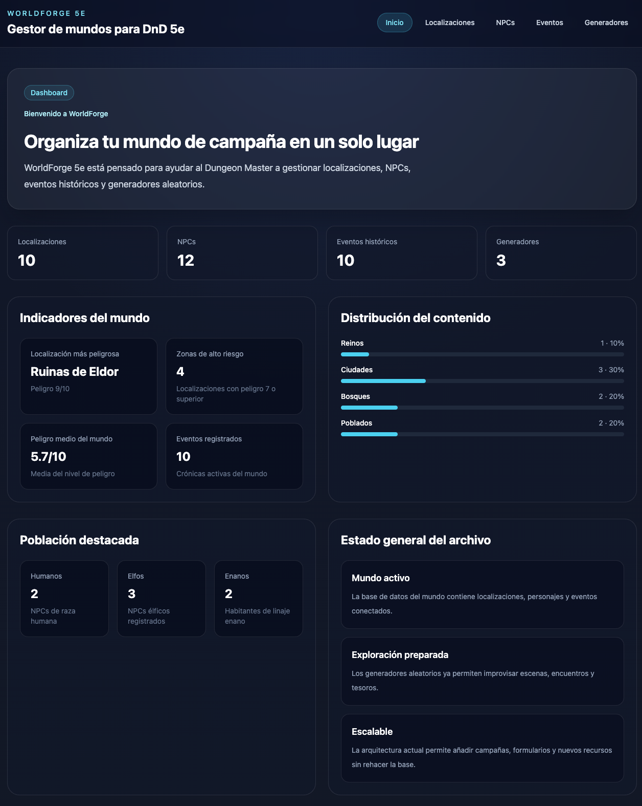

# 🌐 WorldForge 5e

> Gestor de mundos para Dungeons & Dragons 5e  
> Aplicación fullstack desarrollada con React, TypeScript, Tailwind y Express

---

## 🔗 Enlaces del proyecto

🌍 **Frontend (Vercel):**  
https://worldforge-5e.vercel.app/

⚙️ **Backend (Render):**  
https://worldforge-5e.onrender.com

---

## 📖 Descripción

WorldForge 5e es una aplicación web diseñada para ayudar a los Dungeon Masters a gestionar su mundo de campaña de forma sencilla y centralizada.

Permite visualizar y organizar:

- 🗺️ Localizaciones
- 🧙 NPCs
- 📜 Eventos históricos
- 🎲 Generadores

El objetivo es ofrecer una herramienta moderna, rápida y escalable para el worldbuilding.

---

## 🏗️ Arquitectura

La aplicación sigue una arquitectura **fullstack desacoplada**:

Frontend (React + TypeScript + Vite)
↓
Cliente API tipado (fetch)
↓
Backend REST (Node.js + Express)

---

## 🖥️ Frontend

Tecnologías:

- React
- TypeScript
- Vite
- Tailwind CSS
- React Router

Estructura:
src/
├── api/
├── components/
├── context/
├── hooks/
├── pages/
├── types/
└── utils/

Características:

- Componentes reutilizables
- Hooks personalizados (`useLocations`, `useNpcs`, etc.)
- Context API para estado global
- Gestión de estados de red (loading, error, success)
- Diseño responsive

---

## ⚙️ Backend

Tecnologías:

- Node.js
- Express
- TypeScript

Arquitectura por capas:
server/src/
├── routes/
├── controllers/
├── services/
└── config/

Características:

- API REST
- Separación de responsabilidades
- Manejo de errores
- Middleware de CORS
- Endpoints versionados (`/api/v1/...`)

---

## 🔌 API Endpoints

Ejemplos:
GET /api/v1/locations
GET /api/v1/npcs
GET /api/v1/events
GET /api/v1/generators

---

## 🌐 Comunicación frontend-backend

El frontend consume la API mediante `fetch` usando un cliente tipado.

Se gestionan los estados:

- ⏳ Loading
- ✅ Success
- ❌ Error

La URL de la API se configura mediante variables de entorno (`VITE_API_URL`).

---

## 🚀 Despliegue

Frontend:

- Vercel
- Build automático desde GitHub

Backend:

- Render
- Node.js runtime

Notas:

- El backend gratuito puede tardar en responder (cold start)
- Se ha configurado CORS para permitir peticiones desde producción

---

## 🧠 Metodología de trabajo

Se ha utilizado un enfoque tipo **Kanban**:

- Backlog
- To Do
- In Progress
- Review
- Done

Gestión mediante Trello.

---

## 📚 Documentación

Toda la documentación del proyecto se encuentra en docs/:

Incluye:

- Agile y metodologías
- Idea del proyecto
- Arquitectura
- API
- Hooks
- Context
- Testing
- Deployment

---

## 🧪 Testing

Se han realizado pruebas manuales:

- Verificación de endpoints
- Comprobación de errores de red
- Testeo en entorno local y producción

---

## ⚠️ Problemas encontrados

- ❌ Errores de CORS entre frontend y backend
- ❌ Variables de entorno no cargadas en Vercel
- ❌ Backend en Render en estado idle (latencia inicial)
- ❌ Tipado estricto de TypeScript (`verbatimModuleSyntax`)

---

## 🧠 Aprendizajes

- Uso de arquitectura por capas en backend
- Integración frontend-backend real
- Gestión de estado en React
- Uso de Context API
- Configuración de despliegue (Vercel + Render)
- Resolución de errores de CORS

---

## 🤖 Uso de IA

Se ha utilizado IA para:

- Resolución de errores
- Mejora de arquitectura
- Generación de documentación
- Explicación de conceptos técnicos

---

## 📌 Estado del proyecto

✔️ Funcional en producción  
✔️ API conectada  
✔️ Dashboard operativo  
✔️ Arquitectura completa  

---

## 🚀 Mejoras futuras

- CRUD completo (crear/editar/eliminar)
- Autenticación
- Base de datos real
- Testing automatizado
- Mejoras UX/UI
- Cacheo de datos

---

## 👨‍💻 Autor

Pedro Campos

---

